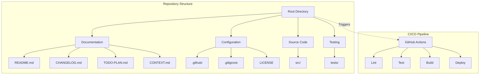

# 🏗️ Architecture Documentation

> Technical Architecture and Design Decisions

**Version**: 1.1.0-20260304-Selasa-23:47 WIB  
**Last Updated**: 2026-03-04  
**Maintained by**: waktuberhenti  
**Status**: Phase 2 - Enhancement

---

## 📋 Table of Contents

1. [Executive Summary](#executive-summary)
2. [System Overview](#system-overview)
3. [Architecture Principles](#architecture-principles)
4. [Component Architecture](#component-architecture)
5. [Technology Stack](#technology-stack)
6. [Design Decisions](#design-decisions)
7. [Security Architecture](#security-architecture)
8. [Scalability Considerations](#scalability-considerations)
9. [Future Roadmap](#future-roadmap)

---

## 📊 Executive Summary

This document outlines the technical architecture of the GitHub Project Blueprint, a comprehensive template repository designed to standardize project initialization and ensure consistent documentation across all projects.

### Purpose
The architecture is designed to provide:
- **Standardization**: Consistent project structure across repositories
- **Scalability**: Ability to adapt from small to enterprise-level projects
- **Maintainability**: Clear separation of concerns and modular design
- **Collaboration**: Enhanced team collaboration through standardized templates

---

## 🎯 System Overview

### High-Level Architecture



### Core Components

| Component | Responsibility | Technology |
|-----------|----------------|------------|
| Documentation | Project information and guides | Markdown |
| Configuration | Repository setup and templates | YAML, JSON |
| CI/CD | Automation and quality assurance | GitHub Actions |
| Templates | Standardized issue and PR formats | Markdown |

---

## 🏛️ Architecture Principles

### 1. Separation of Concerns
Each directory and file has a single, well-defined responsibility:
- `docs/`: Project documentation
- `.github/`: GitHub-specific configurations
- `src/`: Source code
- `tests/`: Testing artifacts

### 2. Modularity
Components are designed to be independent and interchangeable:
- Templates can be customized per project
- CI/CD workflows are modular and extensible
- Documentation follows a hierarchical structure

### 3. Convention over Configuration
Standard naming conventions reduce cognitive load:
- `README.md` as entry point
- `CHANGELOG.md` for version history
- `LICENSE` for legal information

### 4. Documentation-First
All decisions are documented:
- Architecture Decision Records (ADRs)
- Context and rationale documentation
- Clear contribution guidelines

---

## 🧩 Component Architecture

### Documentation Layer

```
docs/
├── CONTRIBUTING.md      # Contribution guidelines
├── CODE_OF_CONDUCT.md   # Community standards
├── SECURITY.md          # Security policies
└── ARCHITECTURE.md      # This document
```

**Responsibilities**:
- Define community interaction standards
- Establish security protocols
- Document technical decisions

### Configuration Layer

```
.github/
├── ISSUE_TEMPLATE/      # Issue templates
├── PULL_REQUEST_TEMPLATE.md
└── workflows/           # CI/CD definitions
```

**Responsibilities**:
- Standardize issue reporting
- Automate quality checks
- Enforce branch protection

### Source Layer

```
src/
├── assets/              # Static resources
├── modules/             # Business logic
└── utils/               # Helper functions
```

**Responsibilities**:
- Implement core functionality
- Maintain code organization
- Support modular development

---

## 💻 Technology Stack

### Core Technologies

| Category | Technology | Version | Purpose |
|----------|------------|---------|---------|
| Version Control | Git | Latest | Source code management |
| Platform | GitHub | Latest | Repository hosting |
| CI/CD | GitHub Actions | Latest | Automation |
| Documentation | Markdown | Standard | Documentation format |

### Supporting Tools

| Tool | Purpose | Integration |
|------|---------|-------------|
| Dependabot | Dependency updates | Automated PRs |
| Markdownlint | Documentation quality | CI pipeline |
| GitHub Pages | Documentation hosting | Automatic deployment |

---

## 📝 Design Decisions

### Decision 1: Markdown as Primary Format

**Context**: Need for a universally supported, readable documentation format.

**Decision**: Use Markdown for all documentation.

**Consequences**:
- ✅ Portable across platforms
- ✅ Easy to read and write
- ✅ Native support in GitHub
- ❌ Limited formatting options compared to HTML

**Status**: ✅ Accepted

---

### Decision 2: GitHub Actions for CI/CD

**Context**: Requirement for automated testing and deployment.

**Decision**: Use GitHub Actions as the CI/CD platform.

**Consequences**:
- ✅ Native GitHub integration
- ✅ Free for public repositories
- ✅ Extensive marketplace
- ❌ GitHub-specific (vendor lock-in)

**Status**: ✅ Accepted

---

### Decision 3: Semantic Versioning with Timestamp

**Context**: Need for clear version tracking with local timezone context.

**Decision**: Implement SemVer with WIB timestamp.

**Consequences**:
- ✅ Clear version progression
- ✅ Local timezone context
- ✅ Consistent format
- ❌ Longer version strings

**Status**: ✅ Accepted

---

### Decision 4: MIT License

**Context**: Desire for maximum adoption and minimal restrictions.

**Decision**: Use MIT License.

**Consequences**:
- ✅ Maximum permissiveness
- ✅ Wide recognition
- ✅ Simple legal terms
- ❌ No copyleft protection

**Status**: ✅ Accepted

---

## 🔒 Security Architecture

### Security Layers

1. **Repository Level**
   - Branch protection rules
   - Required status checks
   - Signed commits

2. **Dependency Level**
   - Automated vulnerability scanning
   - Dependabot alerts
   - Dependency review

3. **Access Control**
   - Role-based permissions
   - Two-factor authentication (2FA)
   - Audit logging

### Security Workflow

```
Developer → PR Created → Automated Checks → Security Scan → Review → Merge
```

---

## 📈 Scalability Considerations

### Horizontal Scaling

The template supports scaling through:
- Modular directory structure
- Pluggable CI/CD workflows
- Extensible documentation system

### Vertical Scaling

Enhancements for larger projects:
- Monorepo support (future)
- Multi-environment deployments
- Advanced testing strategies

---

## 🗺️ Future Roadmap

### Phase 2: Enhancement (Current)
- [ ] Advanced CI/CD pipelines
- [ ] Comprehensive testing framework
- [ ] Documentation automation

### Phase 3: Scale (Planned)
- [ ] Multi-project templates
- [ ] CLI tooling
- [ ] Marketplace integration

---

## 📚 Related Documentation

- [README.md](../README.md) - Project overview
- [CONTRIBUTING.md](CONTRIBUTING.md) - Contribution guidelines
- [SECURITY.md](SECURITY.md) - Security policies
- [CONTEXT.md](../CONTEXT.md) - Project context

---

## 🤝 Contributing to Architecture

To propose architectural changes:
1. Create an Architecture Decision Record (ADR)
2. Submit for review via PR
3. Discuss with maintainers
4. Update documentation upon acceptance

---

<div align="center">

**[⬆ Back to Top](#-architecture-documentation)**

*Last Updated: 1.1.0-20260304-Selasa-23:47 WIB*

**Maintained by waktuberhenti**

</div>
