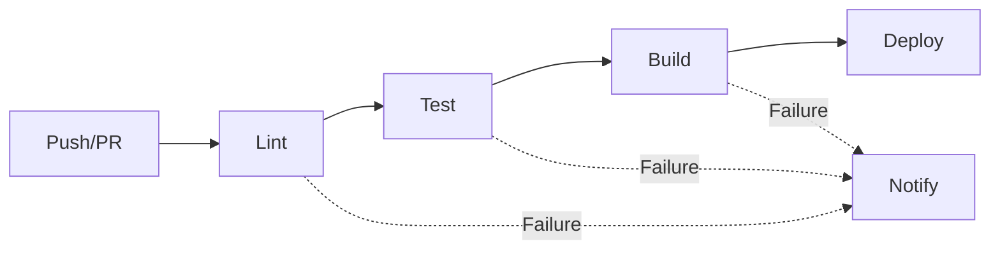

# 👨‍💻 Development Guide

> Comprehensive Guide for Contributors and Maintainers

**Version**: 1.1.0-20260304-Selasa-23:47 WIB  
**Last Updated**: 2026-03-04  
**Maintained by**: waktuberhenti  
**Status**: Phase 2 - Enhancement

---

## 📋 Table of Contents

1. [Getting Started](#getting-started)
2. [Development Environment](#development-environment)
3. [Code Standards](#code-standards)
4. [Testing Strategy](#testing-strategy)
5. [CI/CD Pipeline](#cicd-pipeline)
6. [Release Process](#release-process)
7. [Troubleshooting](#troubleshooting)

---

## 🚀 Getting Started

### Prerequisites

Before contributing, ensure you have the following installed:

| Tool | Version | Purpose |
|------|---------|---------|
| Git | 2.30+ | Version control |
| Node.js | 18.x+ | Runtime environment |
| npm | 9.x+ | Package management |
| Editor | Latest | VSCode recommended |

### Initial Setup

```bash
# 1. Clone the repository
git clone https://github.com/waktuberhenti/github-project-blueprint.git
cd github-project-blueprint

# 2. Configure Git
git config user.name "Your Name"
git config user.email "your.email@example.com"

# 3. Install dependencies (if applicable)
npm install

# 4. Verify setup
npm run verify
```

---

## 🛠️ Development Environment

### Recommended VSCode Extensions

```json
{
  "recommendations": [
    "editorconfig.editorconfig",
    "davidanson.vscode-markdownlint",
    "esbenp.prettier-vscode",
    "streetsidesoftware.code-spell-checker"
  ]
}
```

### Environment Configuration

Create a `.env.local` file for local development:

```bash
# Development settings
NODE_ENV=development
DEBUG=true
```

---

## 📏 Code Standards

### Commit Message Convention

We follow the [Conventional Commits](https://www.conventionalcommits.org/) specification:

```
<type>(<scope>): <description>

[optional body]

[optional footer]
```

#### Types

| Type | Description | Example |
|------|-------------|---------|
| `feat` | New feature | `feat(docs): add architecture documentation` |
| `fix` | Bug fix | `fix(ci): resolve workflow error` |
| `docs` | Documentation only | `docs(readme): update installation steps` |
| `style` | Code style changes | `style(lint): fix markdown formatting` |
| `refactor` | Code refactoring | `refactor(structure): reorganize folders` |
| `test` | Testing | `test(unit): add validation tests` |
| `chore` | Maintenance | `chore(deps): update dependencies` |

### Documentation Standards

#### Markdown Guidelines

1. **Headers**: Use sentence case
   ```markdown
   # Main Title
   ## Section Header
   ### Subsection
   ```

2. **Lists**: Use consistent punctuation
   ```markdown
   - Item one
   - Item two
   - Item three
   ```

3. **Code Blocks**: Specify language
   ```markdown
   ```bash
   npm install
   ```
   ```

4. **Links**: Use descriptive text
   ```markdown
   [Contributing Guidelines](docs/CONTRIBUTING.md)
   ```

---

## 🧪 Testing Strategy

### Testing Pyramid

```
    /\
   /  \
  / E2E \     <- End-to-End Tests
 /--------\
/ Integration\ <- Integration Tests
/--------------\
/    Unit       \ <- Unit Tests (Base)
-----------------
```

### Running Tests

```bash
# Run all tests
npm test

# Run specific test suite
npm run test:unit
npm run test:integration
npm run test:e2e

# Run with coverage
npm run test:coverage

# Run in watch mode
npm run test:watch
```

### Test Coverage Requirements

| Metric | Minimum | Target |
|--------|---------|--------|
| Statements | 80% | 90% |
| Branches | 75% | 85% |
| Functions | 80% | 90% |
| Lines | 80% | 90% |

---

## 🔄 CI/CD Pipeline

### Pipeline Stages



### Stage Details

#### 1. Lint Stage
- **Purpose**: Code quality checks
- **Tools**: Markdownlint, Prettier
- **Trigger**: Every push and PR

#### 2. Test Stage
- **Purpose**: Validate functionality
- **Tools**: Jest, Testing Library
- **Trigger**: Every push and PR

#### 3. Build Stage
- **Purpose**: Prepare artifacts
- **Tools**: GitHub Actions
- **Trigger**: Main branch only

#### 4. Deploy Stage
- **Purpose**: Release to production
- **Tools**: GitHub Releases
- **Trigger**: Tagged releases

---

## 📦 Release Process

### Version Numbering

We follow [Semantic Versioning](https://semver.org/):

```
MAJOR.MINOR.PATCH-TIMESTAMP

Example: 1.1.0-20260304-Selasa-23:47 WIB
```

### Release Checklist

- [ ] All tests passing
- [ ] Documentation updated
- [ ] CHANGELOG.md updated
- [ ] Version bumped
- [ ] Tag created
- [ ] Release notes drafted

### Creating a Release

```bash
# 1. Update version in relevant files
# 2. Update CHANGELOG.md
# 3. Commit changes
git add .
git commit -m "chore(release): bump version to x.x.x"

# 4. Create tag
git tag -a vx.x.x -m "Release version x.x.x"

# 5. Push to remote
git push origin main --tags
```

---

## 🔧 Troubleshooting

### Common Issues

#### Issue: Pre-commit hooks failing

**Solution**:
```bash
# Reinstall hooks
npx husky install

# Or bypass temporarily (not recommended)
git commit -m "message" --no-verify
```

#### Issue: Tests failing locally

**Solution**:
```bash
# Clear cache
npm run test:clear-cache

# Reinstall dependencies
rm -rf node_modules
npm install
```

#### Issue: Merge conflicts

**Solution**:
```bash
# Update local main
git fetch origin
git rebase origin/main

# Resolve conflicts manually, then
git add .
git rebase --continue
```

---

## 📚 Additional Resources

### Internal Documentation
- [Architecture](ARCHITECTURE.md) - System design
- [Contributing](CONTRIBUTING.md) - Contribution process
- [Security](SECURITY.md) - Security guidelines

### External Resources
- [Git Documentation](https://git-scm.com/doc)
- [GitHub Docs](https://docs.github.com/)
- [Semantic Versioning](https://semver.org/)

---

## 📞 Support

For development support:
- Open an issue with `development` label
- Contact maintainers at [your-email@example.com]
- Join discussions in GitHub Discussions

---

<div align="center">

**[⬆ Back to Top](#-development-guide)**

*Last Updated: 1.1.0-20260304-Selasa-23:47 WIB*

**Maintained by waktuberhenti**

</div>
